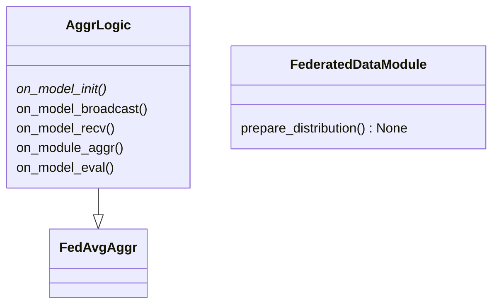
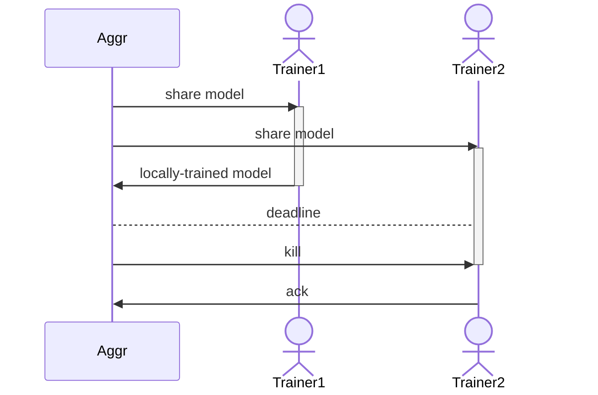

## Callbacks

- ~~**[S]** on_model_init()~~
- **[S]** on_model_broadcast()
- **[W]** on_model_recv()
- **[W]** on_data_fetch()
- **[W]** on_model_fit()
- **[W]** on_model_send()
- **[S]** on_model_collate()
- **[S]** on_module_aggr()
- **[S]** on_model_eval()

***

## Synchronous vs. Asynchronous FL

