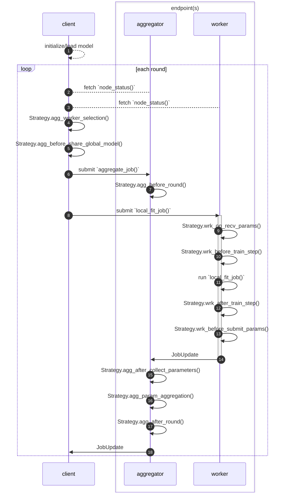

# What Do Strategies Do?

## How do they run?
Below is a sequence diagram of how the `client`, `aggregator`, and `worker` interact with each other during a

```mermaid
sequenceDiagram
    autonumber
%%    box client
        participant client
%%    end
    box endpoint(s)
        participant aggregator
        participant worker
    end


    client-->>client: initialize/load model


    loop each round

        client-->aggregator: fetch `node_status()`
        client-->worker: fetch `node_status()`


        client->>client: Strategy.agg_worker_selection()
        client->>client: Strategy.agg_before_share_global_model()


        client->>aggregator: submit `aggregate_job()`

        aggregator->>aggregator: Strategy.agg_before_round()
        client->>worker: submit `local_fit_job()`

        activate worker
        worker->>worker: Strategy.wrk_on_recv_params()
        worker->>worker: Strategy.wrk_before_train_step()
        worker->>worker: run `local_fit_job()`
        worker->>worker: Strategy.wrk_after_train_step()
        worker->>worker: Strategy.wrk_before_submit_params()
        worker->>aggregator: JobUpdate
        deactivate worker

        aggregator->>aggregator: Strategy.agg_after_collect_parameters()
        aggregator->>aggregator: Strategy.agg_param_aggregation()
        aggregator->>aggregator: Strategy.agg_after_round()

        aggregator->>client: JobUpdate
    end
```
