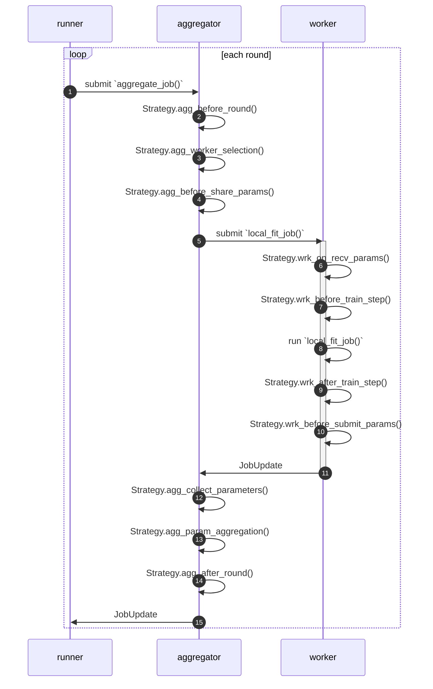

# What Do Strategies Do?

## How do they run?
Below is a sequence diagram of how the `runner`, `aggregator`, and `worker` interact with each other during a 

```mermaid
sequenceDiagram
    autonumber
%%    box client
        participant runner
%%    end
%%    box endpoint(s)
        participant aggregator
        participant worker
%%    end
    
    loop each round
        runner->>aggregator: submit `aggregate_job()`
        
        aggregator->>aggregator: Strategy.agg_before_round()
        aggregator->>aggregator: Strategy.agg_worker_selection()
        aggregator->>aggregator: Strategy.agg_before_share_params()
        aggregator->>worker: submit `local_fit_job()`
        
        activate worker
        worker->>worker: Strategy.wrk_on_recv_params()
        worker->>worker: Strategy.wrk_before_train_step()
        worker->>worker: run `local_fit_job()`
        worker->>worker: Strategy.wrk_after_train_step()
        worker->>worker: Strategy.wrk_before_submit_params()
        worker->>aggregator: JobUpdate
        deactivate worker
        
        aggregator->>aggregator: Strategy.agg_collect_parameters() 
        aggregator->>aggregator: Strategy.agg_param_aggregation()
        aggregator->>aggregator: Strategy.agg_after_round()
        
        aggregator->>runner: JobUpdate
    end
```