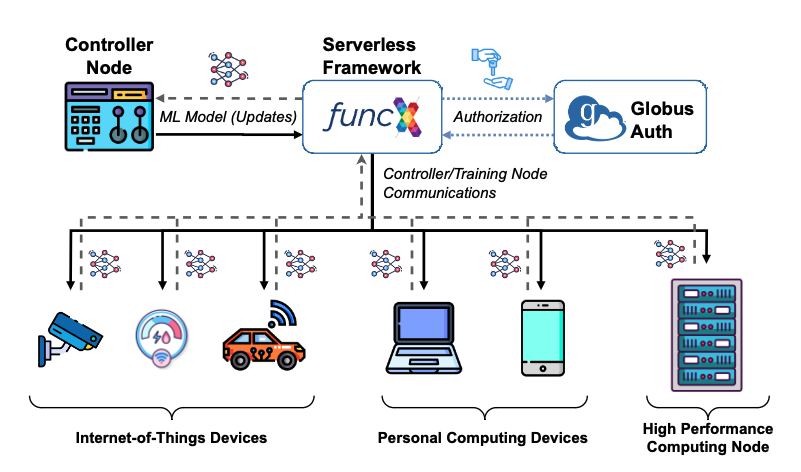

# Welcome to FLoX

For full documentation visit [mkdocs.org](https://www.mkdocs.org).



### Getting Started

#### Installation

The package can be found on pypi:

```bash
pip install flox
```

#### Usage

FLoX is a simple, highly-customizable, and easy-to-deploy framework for hierarchical, multi-tier federated learning
systems built on top of the Globus Compute platform.

```python title="Basic FLoX Example" linenums="1"
from flox import Flock, federated_fit
from torch import nn


class MyModule(nn.Module):
    ...


flock = Flock.from_yaml("my_flock.yaml")
federated_fit(
    module=MyModule(),
    flock=flock,
    strategy="fedavg",
    strategy_params={"participation_frac": 0.5},
    where="local",
    logger="csv",
    log_out="my_results.csv"
)
```
