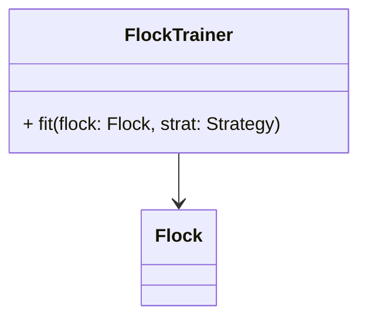

# Overview

```python
import funcx as fx


def run(topo):
    for aggr in topo.aggregators():
        fx(endpoint_id=aggr).submit(
            aggregation_fn,
            aggr,
            topo.subtree(root=aggr)
        )


def aggregation_fn(workers):
    futures = []
    for w in workers:
        fut = fx(endpoint_id=w).submit(
            local_fitting_fn
        )


def local_fitting_fn(worker, worker_logic, module, *args, **kwargs):
    train_data = worker_logic.fetch_train_data()
    valid_data = worker_logic.fetch_valid_data()
    trainer = FloxTrainer()
    results = trainer.fit(
        module,
        train_data,
        valid_data,
        ...
    )
    return results
```

