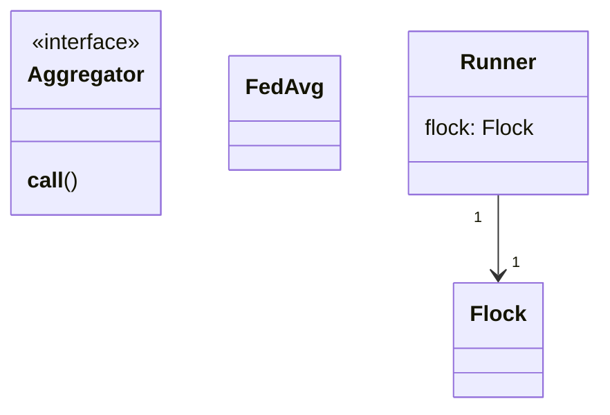

```mermaid
classDiagram
    class Flock {

    }

    class Aggregator {
        <<interface>>
        __call__()
    }

    class FedAvg

    class Runner {
        flock: Flock
    }
    
    Runner "1" --> "1" Flock 
```

```python
def main():
    pass
```