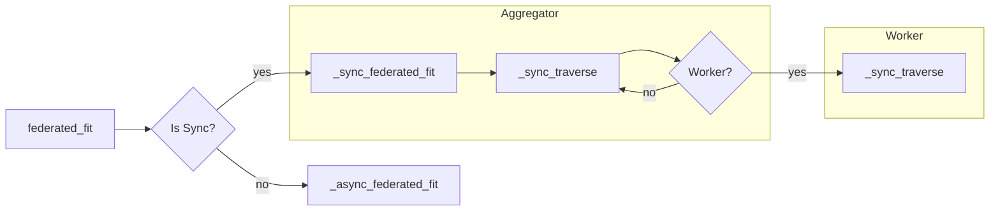

```mermaid
flowchart LR

node1[federated_fit]
node2[_sync_federated_fit]
node3[_async_federated_fit]

split{Is Sync?}
split-->|yes|node2
split-->|no|node3

node1-->split


is_worker{Worker?}
a_step1[_sync_traverse]


    w_step1[_sync_traverse]

subgraph Aggregator
    
    node2-->a_step1
    a_step1-->is_worker
    is_worker-->|no|a_step1
end

subgraph Worker
    w_step1[_sync_traverse]
    is_worker-->|yes|w_step1
end
```