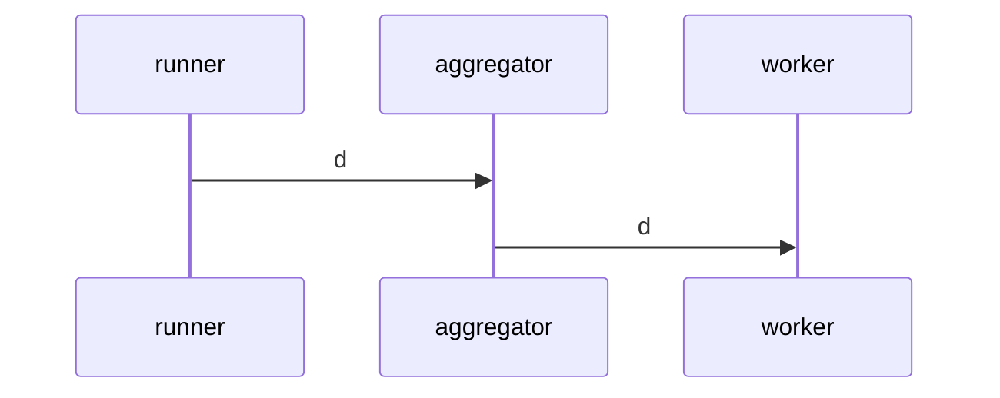

# Strategies in FLoX
Strategies are the classes that encapsulate the logical pieces (i.e., algorithms) for how a _Federated Learning_ (FL) process is performed in FLoX. Some prominent examples in for FL algorithms which would count as a Strategy in FLoX include ``FedAvg`` and ``FedProx`` (FLoX provides working implementations of both).

## How Strategies are Defined
In FLoX, Strategies are a collection of callbacks which are called during the execution of an FL process.

### Aggregator Callbacks

### Worker Callbacks

## How Strategies are Run

