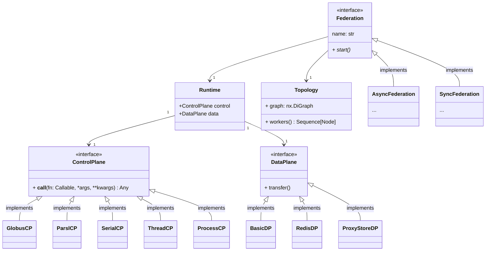

```mermaid
classDiagram
    class Runtime {
        +ControlPlane control
        +DataPlane data
    }

    class ControlPlane {
        <<interface>>
        + __call__(fn: Callable, *args, **kwargs) Any
    }

    class DataPlane {
        <<interface>>
        + transfer()
    }

%% --------

    class Topology {
        + graph: nx.DiGraph
        + workers() Sequence[Node]
    }

%% --------

    class Federation {
        <<interface>>
        name: str
        + start()*
    }

    class AsyncFederation {
        ...
    }

    class SyncFederation {
        ...
    }

%% --------
    Runtime "1" --> "1" ControlPlane
    Runtime "1" --> "1" DataPlane
    Federation --> "1" Topology
    Federation --> "1" Runtime
%% --------
    ControlPlane <|-- GlobusCP: implements
    ControlPlane <|-- ParslCP: implements
    ControlPlane <|-- SerialCP: implements
    ControlPlane <|-- ThreadCP: implements
    ControlPlane <|-- ProcessCP: implements
    DataPlane <|-- BasicDP: implements
    DataPlane <|-- RedisDP: implements
    DataPlane <|-- ProxyStoreDP: implements
    Federation <|-- AsyncFederation: implements
    Federation <|-- SyncFederation: implements

```